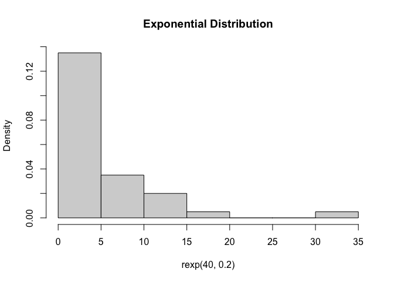
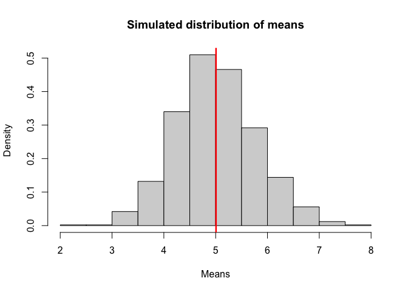
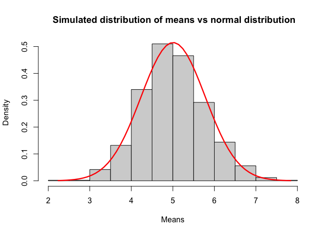
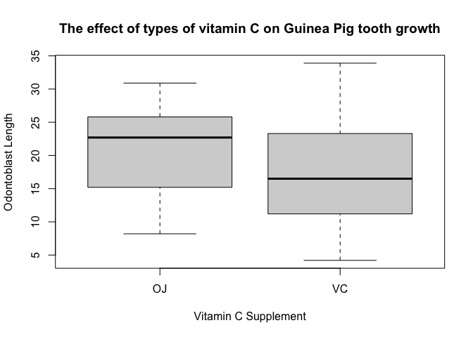
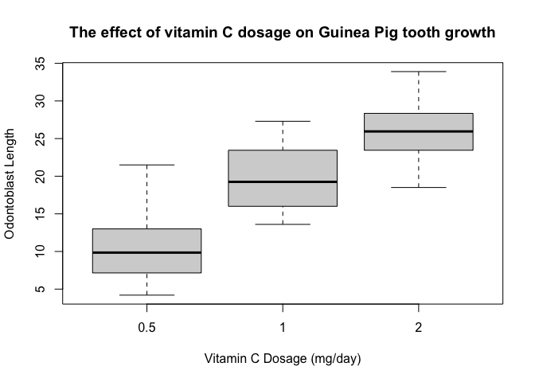

# Statistical Interference Course Project

## Overview

This project is part of the Statistical Interference module as part of the Data Science Specialization with Coursea. Part 1 investigates the exponential distribution and compares it with the central limit theorem by simulating data. Part 2 uses exploratory and statical analysis on a dataset in R.


## Part One: Simulation Excersise

In part one of this project, I am going to investigate the exponential distribution in R and compare it with the central limit theorem. <p>

Firstly, I have set the seed so this project is reproducible.


```r
set.seed(2022)
```

This is what a random exponential distribution would look like, with 40 samples with a rate parameter (lambda) of 0.2. 


```r
hist(rexp(40,0.2), prob = TRUE, main = "Exponential Distribution")
```

<!-- -->

To calculate the theoretical mean of an exponential distribution, we find the inverse of the rate parameter. In this case its 1/0.2. This gives us a a theoretical mean value of 5.


```r
TheoreticalMean <- (1/0.2)
print(TheoreticalMean)
```

```
## [1] 5
```

Furthermore, we can find the theoretical variance of the exponential distribution by finding the inverse of the rate parameter squared. 


```r
TheoreticalVar <- (1/(0.2^2))
print(TheoreticalVar)
```

```
## [1] 25
```

The theoretical mean is based on assumptions about the population that may not be realistic. Hence a more accurate way of estimating the mean can be used. Finding the means of means is a way of estimating the mean of the underlying population from which the samples were drawn. 

This script simulates 1000 random samples of size 40 from an exponential distribution with rate parameter (lambda) 0.2, and then calculates the mean of each sample. The resulting means are then plotted in a histogram, and the overall mean of the means is calculated and printed.


```r
means = NULL
for (i in 1 : 1000) means = c(means, mean(rexp(40, 0.2)))
hist(means, prob = TRUE, main = "Simulated distribution of means", xlab = "Means")
SampleMean <-mean(means)

abline(v = SampleMean, col = "red", lwd = 2.5)
```

<!-- -->

```r
print(SampleMean)
```

```
## [1] 5.007287
```


As you can see from the histogram, the distribution is approximately normal. The central limit theorem suggests that the distribution of the means of these samples should be approximately normal, even though the underlying distribution is exponential. <p>

The mean is 5.007 and is shown on the histogram by the red line. As the mean of the sample means is likely to be closer to the actual population mean, the variance should be closer to 0.


```r
SampleVar <- var(means)
print(SampleVar)
```

```
## [1] 0.6003408
```

A table has been created to highlight the differences in the means and variances from the theoretical and sample distribution.


```r
data.frame(Theoretical = c(TheoreticalMean, TheoreticalVar), 
           Sample = c(SampleMean, SampleVar),
           Difference = c(TheoreticalMean-SampleMean, TheoreticalVar-SampleVar),
           row.names = c("Mean", "Variance") )
```

```
##          Theoretical    Sample   Difference
## Mean               5 5.0072868 -0.007286823
## Variance          25 0.6003408 24.399659204
```

From this table, the difference in means is -0.007 and the difference in variance is 24.400. The variance of the sample data (0.600) is much lower than the variance of the theoretical data (25), which suggests that the sample data points are more closely concentrated around the mean. This could indicate that the sample mean (5.007) is a more accurate estimate of the population mean than the theoretical mean (5). <p>


<p> To further show that the distribution is approximately normal, I have overlaid what a theoretical normal distribution would look like following the mean and standard deviations of the sample means. The seq function creates a series of numbers and is set as the x axis for the overlay. The dnorm function creates the density of a series of numbers that follow the normal distribution, which is used as the y axis for the overlay. <p> 

```r
hist(means, prob = TRUE, xlab = "Means", main=" Simulated distribution of means vs normal distribution")

x = seq(min(means), max(means), by=0.1)
y = dnorm(x, mean(means), sd(means))
lines(x,y, col = "red", lwd = 2.5)
```

<!-- -->

The theoretical normal distribution is indicated by the red line. As we can see, the simulated distribution of means is approximately normal. 

## Part 2: Inferential Data Analysis - ToothGrowth

In the next part of this assignment, I am going to perform a statistical analysis on the effect of vitamin C on guinea pig tooth growth. <p>

### Data Summary/Exploratary Data Analysis

The data set, "ToothGrowth", found in base R is going to be analysed here. According to the [R documentation](https://www.rdocumentation.org/packages/datasets/versions/3.6.2/topics/ToothGrowth), the data set contains the length of odontoblasts (cells responsible for tooth growth) in 60 guinea pigs. Each animal received one of three dose levels of a supplement of vitamin C (0.5, 1, and 2 mg/day) by one of two delivery methods: orange juice or ascorbic acid (a form of vitamin C). <p>

Firstly, I loaded the data set and the packages required for the analysis. <p>


```r
library(dplyr)
data("ToothGrowth")
```

The head of the data and a basic statistical summary is provided here:


```r
head(ToothGrowth)
```

```
##    len supp dose
## 1  4.2   VC  0.5
## 2 11.5   VC  0.5
## 3  7.3   VC  0.5
## 4  5.8   VC  0.5
## 5  6.4   VC  0.5
## 6 10.0   VC  0.5
```

```r
summary(ToothGrowth)
```

```
##       len        supp         dose      
##  Min.   : 4.20   OJ:30   Min.   :0.500  
##  1st Qu.:13.07   VC:30   1st Qu.:0.500  
##  Median :19.25           Median :1.000  
##  Mean   :18.81           Mean   :1.167  
##  3rd Qu.:25.27           3rd Qu.:2.000  
##  Max.   :33.90           Max.   :2.000
```

The length of the odontoblast is characterized as "len". The supplement of vitamin C used is characterized as "supp". Orange juice and ascorbic acid are characterized as "OJ" and "VC" respectively. <p>

If we group the data by "supp" (using dplyr), we can calculate statistics for each supplement.


```r
ToothGrowth %>% group_by(supp) %>%  summarise(Mean = mean(len), SD = sd(len))
```

```
## # A tibble: 2 × 3
##   supp   Mean    SD
##   <fct> <dbl> <dbl>
## 1 OJ     20.7  6.61
## 2 VC     17.0  8.27
```

We can create a boxplot for the effect of supplement on length.

```r
boxplot(len ~ supp, data = ToothGrowth, xlab = "Vitamin C Supplement", ylab = "Odontoblast Length", main = "The effect of types of vitamin C on Guinea Pig tooth growth")
```

<!-- -->

These results suggest that OJ has an increased effect on tooth growth than VC. The significance of this will be tested in the next section. <p>

We can do the same for "dose" too. <p>


```r
ToothGrowth %>% group_by(dose) %>%  summarise(Mean = mean(len), SD = sd(len))
```

```
## # A tibble: 3 × 3
##    dose  Mean    SD
##   <dbl> <dbl> <dbl>
## 1   0.5  10.6  4.50
## 2   1    19.7  4.42
## 3   2    26.1  3.77
```

And create another box plot.. <p>


```r
boxplot(len ~ dose, data = ToothGrowth, xlab = "Vitamin C Dosage (mg/day)", ylab = "Odontoblast Length", main = "The effect of vitamin C dosage on Guinea Pig tooth growth")
```

<!-- -->
<br>These results suggest that the higher the vitamin C dosage, the higher the tooth growth. The siginifance of this will be tested in the next section.

### Hypothesis testing 

The first hypothesis that I am going to test is, <b>"OJ causes increased tooth growth than VC"</b>, with its null being <b>"A change in vitamin C supplement has no effect on tooth growth"</b> <p>

To test this, I am going to perform an independent two sample t-test. As we are assuming the populations have unequal variances, we will use the Welches t-test. We are also assuming the populations have a normal distribution, and that the samples are independent. <p>


```r
t.test(len~supp, data = ToothGrowth, alternative = "greater")
```

```
## 
## 	Welch Two Sample t-test
## 
## data:  len by supp
## t = 1.9153, df = 55.309, p-value = 0.03032
## alternative hypothesis: true difference in means between group OJ and group VC is greater than 0
## 95 percent confidence interval:
##  0.4682687       Inf
## sample estimates:
## mean in group OJ mean in group VC 
##         20.66333         16.96333
```

The p value is 0.03, which is less than 0.05, hence we can reject the null hypothesis. We can conclude that OJ causes increased tooth growth than VC. 
<p><p> Next I am going to test the hypothesises, <b>"A dose of 1.0 causes increased tooth growth than 0.5"</b> and <b>"A dose of 2.0 causes increased tooth growth than 1.0".</b> The null hypothesis for both is "An increase in dose has no effect on tooth growth". <br>
Again, we are assuming the populations have unequal variances, the populations have a normal distribution, and that the samples are independent.<p>


Firstly, 0.5 and 1.0 is going to be tested. <p>


```r
t.test(len~dose, dose %in% c(0.5, 1.0),data = ToothGrowth, alternative = "less")
```

```
## 
## 	Welch Two Sample t-test
## 
## data:  len by dose
## t = -6.4766, df = 37.986, p-value = 6.342e-08
## alternative hypothesis: true difference in means between group 0.5 and group 1 is less than 0
## 95 percent confidence interval:
##       -Inf -6.753323
## sample estimates:
## mean in group 0.5   mean in group 1 
##            10.605            19.735
```
The p value is <b>6.342e-08</b>, which is <b>< 0.05.</b> <p>


Next I am going to test 1.0 and 2.0.


```r
t.test(len~dose, dose %in% c(1.0, 2.0),data = ToothGrowth, alternative = "less")
```

```
## 
## 	Welch Two Sample t-test
## 
## data:  len by dose
## t = -4.9005, df = 37.101, p-value = 9.532e-06
## alternative hypothesis: true difference in means between group 1 and group 2 is less than 0
## 95 percent confidence interval:
##      -Inf -4.17387
## sample estimates:
## mean in group 1 mean in group 2 
##          19.735          26.100
```

The p value is <b>9.532e-06</b>, which is <b> <0.05 </b>. <p> From these results we can conclude that <b>an increase in vitamin dose causes a significant increase in tooth growth</b>, hence the <b>null hypothesis can be rejected</b>.

Based on these conclusions, we can assume that OJ and a dose of 2.0 is the best combination for tooth growth. However, we can do another statistical test to confirm this. <br>
A final two sample t-test was performed to determine if there was a significant difference in tooth growth when a dose of 2.0 of OJ was used compared with VC. Again, we are assuming the populations have unequal variances, the populations have a normal distribution, and that the samples are independent.


```r
t.test(len~supp, dose %in% c(2.0),data = ToothGrowth, alternative = "less")
```

```
## 
## 	Welch Two Sample t-test
## 
## data:  len by supp
## t = -0.046136, df = 14.04, p-value = 0.4819
## alternative hypothesis: true difference in means between group OJ and group VC is less than 0
## 95 percent confidence interval:
##    -Inf 2.9735
## sample estimates:
## mean in group OJ mean in group VC 
##            26.06            26.14
```
The p-value is <b>0.4819</b>, which is <b>>0.05</b>. This suggests that <b>there is no significant effect on the supplement used when the dose is 2.0</b>. A discussion about the implication of this is beyond the scope of this assignment, however in future tests we could use power, p-value adjustment or even bootstrapping to increase the reliability/strength of the tests and results. 
